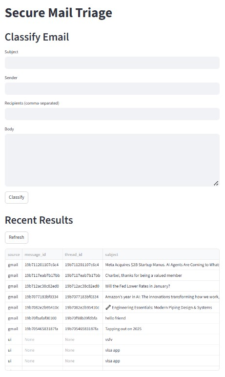
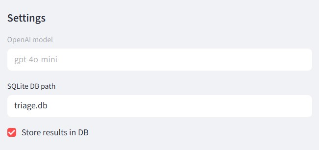

# Secure Mail Triage LLM

LLM-agentic workflow for classifying and triaging phishing emails with Gmail ingestion, a CLI/UI, and SQLite audit storage. The pipeline keeps decisions explainable and easy to extend while relying on OpenAI-powered agents.

## Problem description
Phishing emails remain a top initial access vector. Manual review is slow and inconsistent, which delays response and increases risk. This project implements an LLM-agentic workflow that classifies incoming messages as phishing or legitimate using specialized LLM agents and a final aggregation step, with optional Gmail ingestion and persistent audit logs.

## Agentic classification workflow
The pipeline decomposes classification into small, specialized LLM agents plus a final aggregator.

1. **Email Structure Agent** -> normalizes headers/body, extracts URLs/domains, enforces size/attachment limits, and outputs structured fields.
2. **Tone & Intent LLM Agent** -> scores urgency, coercion, and impersonation cues in the normalized body text.
3. **Content Policy LLM Agent** -> flags credential harvest attempts, payment/transfer asks, and PII collection with detected term spans.
4. **Link & Attachment Safety LLM Agent** -> evaluates domains and attachment metadata for risk.
5. **User/Org Context LLM Agent** -> applies allow/block lists and simple anomalies (duplicate recipients) to adjust risk.
6. **LLM Aggregator** -> fuses all agent outputs into a risk score and verdict with rationale.

### Data flow
- Intake via **Email Structure Agent** -> LLM agents (tone, content, safety, context) -> **LLM Aggregator**.
- Each agent returns structured `features` and `warnings` that remain visible in the final result for debugging and auditability.

### Observability & guardrails
- Guardrails: input validation and limits (body length, attachment count) to prevent pathological inputs from derailing classification.
- Observability: agents emit structured data and warnings; the aggregator surfaces a rationale list summarizing why risk increased.

## Legacy rule-based demo (optional)
Run the example script to see the original rule-based pipeline in action. The CLI/UI use the LLM pipeline.

```bash
python example_usage.py
```

Expected output (similar to):
```
=== Email 1: Urgent: Verify your account immediately ===
{'rationale': ['Urgent language detected', 'Requests credentials', 'Risky domains detected'],
 'risk_score': 7,
 'verdict': 'phishing'}

=== Email 2: Team lunch reminder ===
{'rationale': [], 'risk_score': -2, 'verdict': 'legitimate'}

=== Email 3: Invoice for your recent purchase ===
{'rationale': ['Requests payment/transfer', 'Risky attachment: invoice.js', 'Duplicate recipients anomaly'],
 'risk_score': 6,
 'verdict': 'phishing'}
Warnings: ['Duplicate recipients detected']
```

You can adjust allow/block lists, reputation hints, and the phishing threshold inside `ClassificationPipeline` to match your environment.

## Setup (ML agentic pipeline + Gmail)
Install dependencies:

```bash
python -m venv .venv
.venv\Scripts\activate
pip install -r requirements.txt
```

Set your OpenAI key (and optional model):

```bash
# PowerShell
$env:OPENAI_API_KEY="your_key_here"
$env:OPENAI_MODEL="gpt-4o-mini"
```

`OPENAI_MODEL` is optional. The UI uses a fixed model (`gpt-4o-mini`), while the CLI can override the model with `--model`.


## ML agentic quickstart (LLM agents)
Classify a single email from text using LLM-backed agents:

```bash
python -m secure_mail_triage.cli text --subject "Test" --body "Please verify your account"
```

## Gmail ingestion
1. Create a Google Cloud project and enable the Gmail API.
2. Create OAuth client credentials (Desktop app) and download `credentials.json`.
3. Place `credentials.json` in the repo root (or pass `--credentials`).
4. Run:

```bash
python -m secure_mail_triage.cli gmail --query "newer_than:7d" --max-results 5
```

The first run opens a browser for OAuth and writes `token.json`.

## Data persistence
Results are stored in SQLite (default `triage.db`) with verdicts, rationale, and agent outputs.
You can change the location with `--db`.

## UI (Streamlit)
Run a lightweight UI for manual triage and viewing recent results:

```bash
streamlit run secure_mail_triage/ui_app.py
```

The UI uses the fixed model `gpt-4o-mini` and reads `OPENAI_API_KEY` from the environment.

Screenshots:




## Notes
- LLM mode sends email content to the OpenAI API. Use only with permission and avoid sensitive data when required.

## Ethical AI Considerations
- Privacy & data minimization: Gmail access is read-only; attachments are not downloaded; storage is optional and limited to results metadata.
- Consent & user control: The system is run only on accounts with explicit user authorization; results storage can be disabled.
- Transparency & explainability: Outputs include a risk score and a rationale list; agent outputs are stored for audit when enabled.
- Human oversight: The tool provides triage suggestions; final decisions remain with a human reviewer.
- Robustness & prompt injection: System prompts explicitly treat email text as untrusted and ignore instructions inside it.
- Security: API keys are read from environment variables; OAuth tokens are stored locally and ignored by Git.
